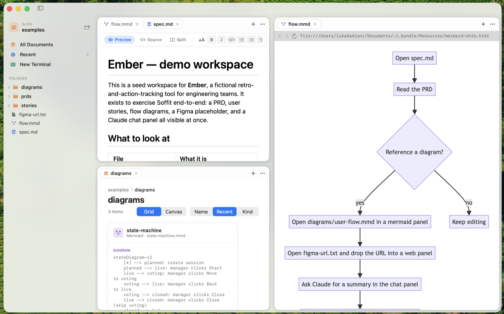

# Soffit

**A native Mac workspace for markdown.**

Tile any folder. Edit. Preview. Sketch. All in one window.

## Why

Markdown lives in folders. Folders should live in panes.

Drag a tab. Split it. Drop a file on a canvas. Sticky-note a retro. Edit a PRD beside a mermaid diagram beside a Figma frame beside a terminal running `claude`.

No vault. No plugin manager. No syncing service. Your files stay where you put them.

For the post-Obsidian crowd who'd rather not run Electron.

## Install

[**Download Soffit-0.3.0.dmg**](https://github.com/lukataylo/soffit/releases/latest) → drag to Applications → right-click **Open** the first time.

Requires macOS 14. Apple Silicon preferred. Intel will do.

> Or build from source — see the [Quickstart](https://github.com/lukataylo/soffit/wiki/Quickstart).

## In the box

- **Markdown editor** — Preview, Source, Split. Real GFM rendering. Tables. Code. Lists. The works.
- **Folder canvases** — drop files anywhere. Drag them around. Sticky notes. Zoom. Pan. Per folder.
- **Mermaid diagrams** — render `.mmd` files inline. No internet required.
- **Web embeds** — Figma frames, localhost dashboards, anything WKWebView loads.
- **Embedded terminal** — drop into `claude`, `git`, `vim`. Whatever you'd put in iTerm.
- **Tile anything** — drag any tab onto any pane. A compass picks the side.
- **It remembers** — quit, reopen. Panes, tabs, modes, canvas positions: exactly where you left them.

## Docs

The [wiki](https://github.com/lukataylo/soffit/wiki) has the rest:

[Quickstart](https://github.com/lukataylo/soffit/wiki/Quickstart) · [Canvas mode](https://github.com/lukataylo/soffit/wiki/Canvas-mode) · [Markdown editing](https://github.com/lukataylo/soffit/wiki/Markdown-editing) · [Keyboard shortcuts](https://github.com/lukataylo/soffit/wiki/Keyboard-shortcuts) · [Providers](https://github.com/lukataylo/soffit/wiki/Providers) · [Persistence](https://github.com/lukataylo/soffit/wiki/Persistence) · [Architecture](https://github.com/lukataylo/soffit/wiki/Architecture) · [FAQ](https://github.com/lukataylo/soffit/wiki/FAQ)

Implementation tradeoffs and decisions live in [`DECISIONS.md`](DECISIONS.md).

## License

MIT — see [LICENSE](LICENSE).
